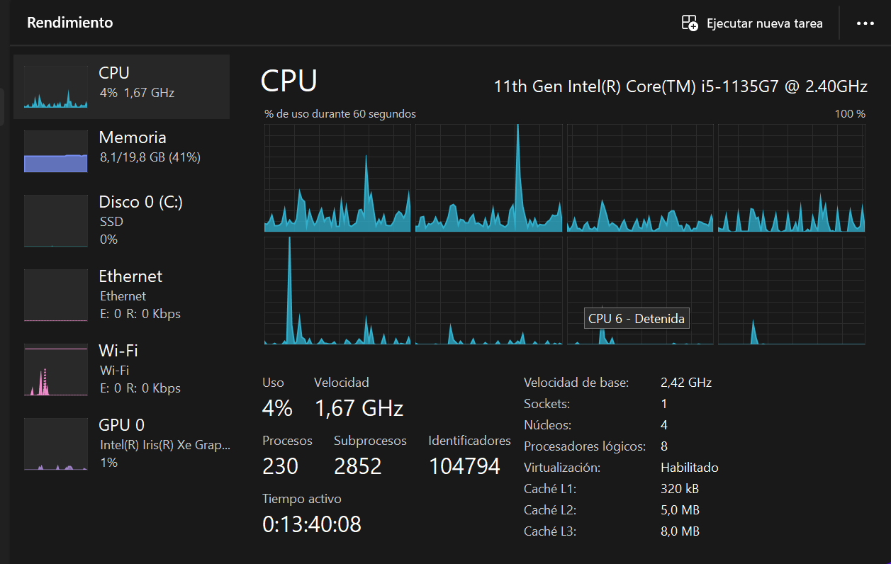
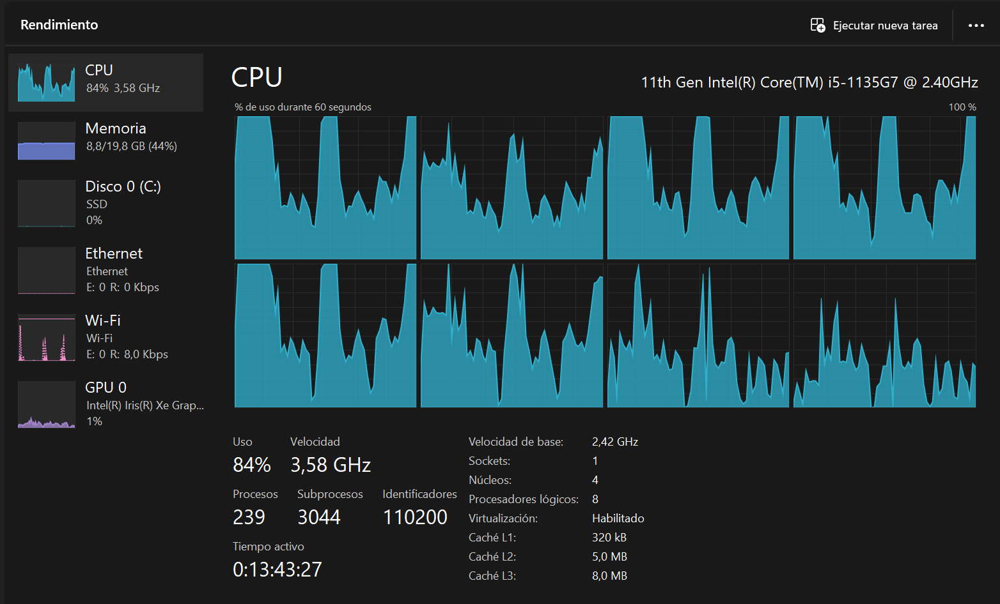
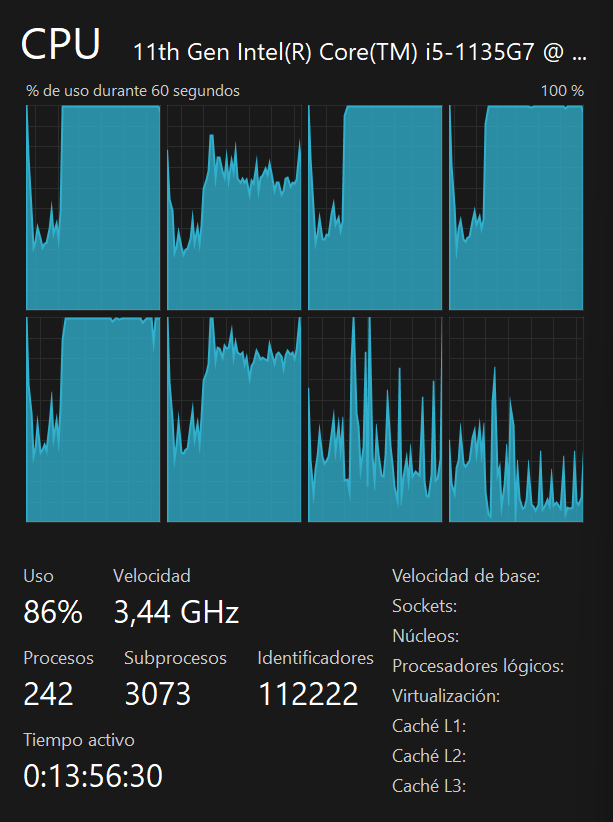
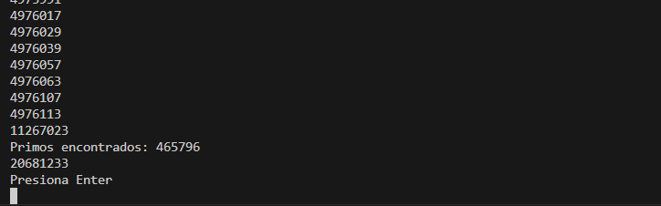
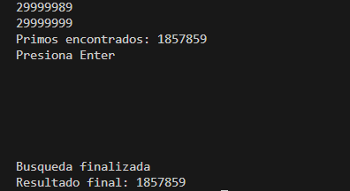
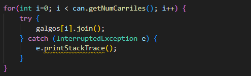
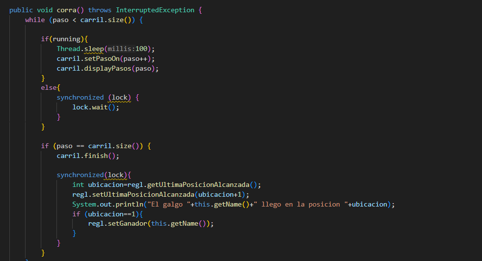
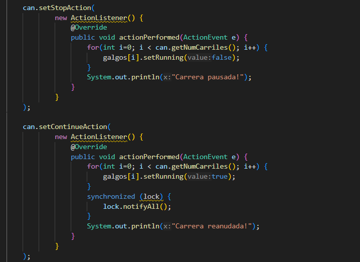
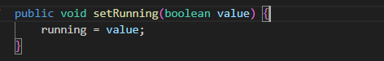

Escuela Colombiana de Ingeniería

Arquitecturas de Software – ARSW

Autores: Jeisson Steban Casallas Rozo y David Leonardo Piñeros Cortés

#### Taller – programación concurrente, condiciones de carrera y sincronización de hilos. EJERCICIO INDIVIDUAL O EN PAREJAS.

##### Parte I – Antes de terminar la clase.

Creación, puesta en marcha y coordinación de hilos.

1. Revise el programa “primos concurrentes” (en la carpeta parte1), dispuesto en el paquete edu.eci.arsw.primefinder. Este es un programa que calcula los números primos entre dos intervalos, distribuyendo la búsqueda de los mismos entre hilos independientes. Por ahora, tiene un único hilo de ejecución que busca los primos entre 0 y 30.000.000. Ejecútelo, abra el administrador de procesos del sistema operativo, y verifique cuantos núcleos son usados por el mismo.

**Antes**

**Despues**

**Conclusión:** Como podemos ver antes de la ejecución el CPU esta usando apenas el 4%, cuando ya empezamos a correr el codigo el uso del CPU se aumenta considerablemente su uso, en donde podemos ver que los graficos se mantienen arriba durante gran parte de su ejecución con un uso por encima del 84%. Despues de cierto tiempo se empieza a estabilizar, por lo que su uso empieza a tender a ser constante.

2. Modifique el programa para que, en lugar de resolver el problema con un solo hilo, lo haga con tres, donde cada uno de éstos hará la tarcera parte del problema original. Verifique nuevamente el funcionamiento, y nuevamente revise el uso de los núcleos del equipo.

**Conclusión:** Realmente no vemos diferencia en cuanto al uso de los nucleos del equipo cuando le agregamos otros 2 hilos mas, pues su uso en la CPU sigue siendo el mismo, mientras que los graficos siguen teniendo la misma tendencia a aumentar y estabilizarse con el pasar del tiempo.

3. Lo que se le ha pedido es: debe modificar la aplicación de manera que cuando hayan transcurrido 5 segundos desde que se inició la ejecución, se detengan todos los hilos y se muestre el número de primos encontrados hasta el momento. Luego, se debe esperar a que el usuario presione ENTER para reanudar la ejecución de los mismo.

##### Parte II 

Para este ejercicio se va a trabajar con un simulador de carreras de galgos (carpeta parte2), cuya representación gráfica corresponde a la siguiente figura:

En la simulación, todos los galgos tienen la misma velocidad (a nivel de programación), por lo que el galgo ganador será aquel que (por cuestiones del azar) haya sido más beneficiado por el *scheduling* del
procesador (es decir, al que más ciclos de CPU se le haya otorgado durante la carrera). El modelo de la aplicación es el siguiente:

Como se observa, los galgos son objetos ‘hilo’ (Thread), y el avance de los mismos es visualizado en la clase Canodromo, que es básicamente un formulario Swing. Todos los galgos (por defecto son 17 galgos corriendo en una pista de 100 metros) comparten el acceso a un objeto de tipo
RegistroLLegada. Cuando un galgo llega a la meta, accede al contador ubicado en dicho objeto (cuyo valor inicial es 1), y toma dicho valor como su posición de llegada, y luego lo incrementa en 1. El galgo que
logre tomar el ‘1’ será el ganador.

Al iniciar la aplicación, hay un primer error evidente: los resultados (total recorrido y número del galgo ganador) son mostrados antes de que finalice la carrera como tal. Sin embargo, es posible que una vez corregido esto, haya más inconsistencias causadas por la presencia de condiciones de carrera.

Taller.

1.  Corrija la aplicación para que el aviso de resultados se muestre
    sólo cuando la ejecución de todos los hilos ‘galgo’ haya finalizado.
    Para esto tenga en cuenta:

    a.  La acción de iniciar la carrera y mostrar los resultados se realiza a partir de la línea 38 de MainCanodromo.

    b.  Puede utilizarse el método join() de la clase Thread para sincronizar el hilo que inicia la carrera, con la finalización de los hilos de los galgos.

    

    En este caso le agregamos el metodo join en el main para que el programa arroje un ganador una vez todos los hilos han terminado su ejecución.
    De esta manera nos aseguramos de que no nos muestre un resultado antes de la finalización de la carrera.

2.  Una vez corregido el problema inicial, corra la aplicación varias
    veces, e identifique las inconsistencias en los resultados de las
    mismas viendo el ‘ranking’ mostrado en consola (algunas veces
    podrían salir resultados válidos, pero en otros se pueden presentar
    dichas inconsistencias). A partir de esto, identifique las regiones
    críticas () del programa.

    **Respuesta:** El problema identificado al momento de verificar dichas ejecuciones consiste en que al momento de dar el ganador y el orden de llegada de estos, en ocasiones dos galgos salian en la misma posición.
    La región critica se viene dando en la clase Galgo en el metodo Corra(), aca es donde se asignan las posiciones a los galgos al momento de su llegada, por lo que es donde tenemos la interferencia entre hilos.

3.  Utilice un mecanismo de sincronización para garantizar que a dichas
    regiones críticas sólo acceda un hilo a la vez. Verifique los
    resultados.
    
    

    **Respuesta:** En este caso con un syncronized en esta sección del codigo, logramos que ingresen a esta zona de uno en uno y no tengamos condiciones carrera.

4.  Implemente las funcionalidades de pausa y continuar. Con estas,
    cuando se haga clic en ‘Stop’, todos los hilos de los galgos
    deberían dormirse, y cuando se haga clic en ‘Continue’ los mismos
    deberían despertarse y continuar con la carrera. Diseñe una solución que permita hacer esto utilizando los mecanismos de sincronización con las primitivas de los Locks provistos por el lenguaje (wait y notifyAll).

    
    

    **Respuesta:** Para caso vamos a implementar estos botones desde el main, desde donde vamos a jugar con lo hecho desde la clase Thread. En este caso un metodo llamado setRunning, con el cual vamos a condicionar el metodo corra() para cuando la variable running se encuentre true se ejecute el codigo y cuando este en false mande los hilos a espera con el wait. De igual forma con el notifyall desde el main, el cual va a reundar los hilos con ayuda de este mismo metodo.
    

## Criterios de evaluación

1. Funcionalidad.

    1.1. La ejecución de los galgos puede ser detenida y resumida consistentemente.
    
    1.2. No hay inconsistencias en el orden de llegada registrado.
    
2. Diseño.   

    2.1. Se hace una sincronización de sólo la región crítica (sincronizar, por ejemplo, todo un método, bloquearía más de lo necesario).
    
    2.2. Los galgos, cuando están suspendidos, son reactivados son sólo un llamado (usando un monitor común).

